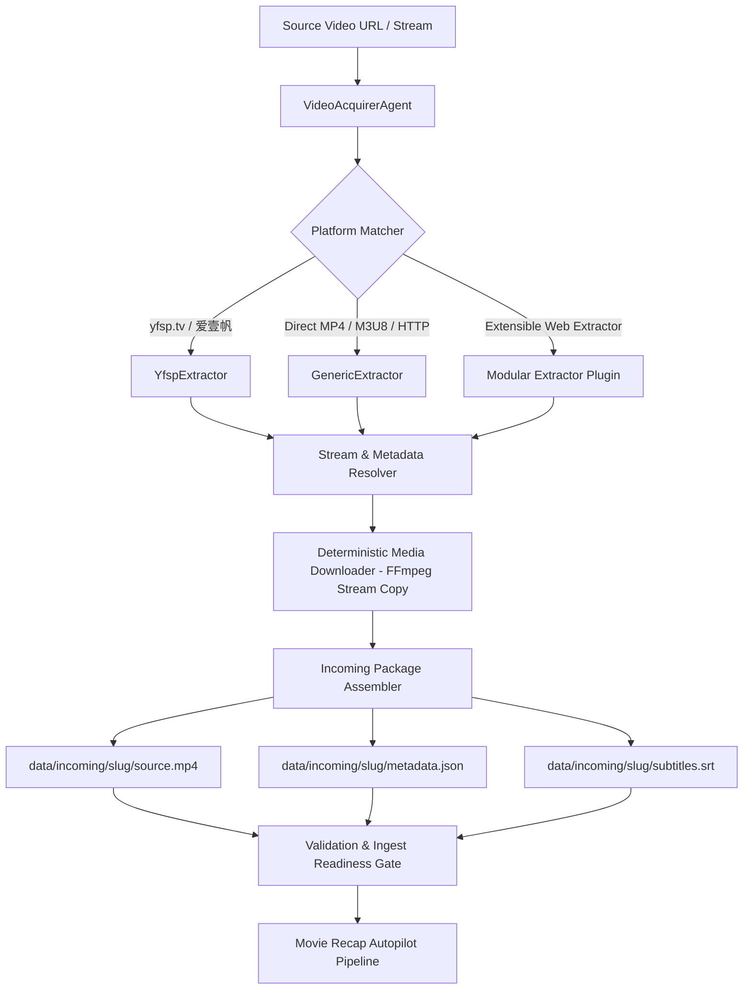

# Video Acquisition & Ingestion Agent Specification

**Version:** 1.0  
**Status:** Active  
**Last Updated:** 2026-09-13  
**Superseded By:** N/A  

---

## 1. Executive Summary & Purpose

The **Video Acquisition Agent** (`src/acquirer/`) automates the discovery, extraction, downloading, and pre-processing of source video assets from external URLs, streaming platforms, and raw media links. 

It prepares source video assets into the exact, validated incoming directory structure (`data/incoming/<slug>/`) required by the **Movie Commentary Autopilot** pipeline (FR-1).

---

## 2. Architecture & Extractor Protocol



---

## 3. Worker Contracts & Extractor Interface

### 3.1 Base Extractor (`BaseVideoExtractor`)
Every platform extractor must implement:
- `can_handle(url: str) -> bool`: Deterministic URL regex matching.
- `extract_metadata(url: str) -> VideoMetadata`: Returns structured title, actors, director, synopsis, release year, duration, cover image, and tags.
- `resolve_stream(url: str) -> StreamInfo`: Resolves direct HLS (`.m3u8`), MP4, or DASH media stream URL with required HTTP headers.

### 3.2 Native Platform Extractors
1. **`YfspExtractor` (爱壹帆 / yfsp.tv)**:
   - Dynamic injection key parser (`injectJson` / `pConfig`).
   - Cryptographic request signing (`MD5(publicKey + query.lower() + privateKey)`).
   - Multi-resolution stream resolution (4K, 1080p, 720p, 576p HLS/MP4).
   - Rich Chinese film metadata extraction (title, synopsis, actors, director, release year, category).
2. **`GenericVideoExtractor`**:
   - Handles direct `.mp4`, `.webm`, `.m3u8`, or standard media URLs.
   - Extracts stream properties via FFprobe metadata probes.

---

## 4. Prepared Output Package Specification

The Video Acquirer outputs a standardized directory ready for immediate processing:

```
data/incoming/<slug>/
├── source.mp4          # High-quality H.264/AAC video file
├── metadata.json       # Structured movie metadata
├── subtitles.srt       # (Optional) Extracted / translated subtitles
└── cover.jpg           # (Optional) High-res poster/cover art
```

### `metadata.json` Schema:
```json
{
  "title": "微风襟袖同卿心",
  "source_url": "https://www.yfsp.tv/play/zqBWB3mQYiB?id=2XQtVuG1mT3",
  "year": "2026",
  "genre": "爱情,古装,横屏",
  "directors": ["张亚海"],
  "stars": ["范梦", "张植绿"],
  "synopsis": "本剧讲述本庸碌无为的李度，在妻子杨策的鼓励与鞭策之下蜕变成长...",
  "duration_seconds": 581.16,
  "resolution": "960x540",
  "acquired_at": "2026-09-13T14:40:00Z"
}
```

---

## 5. Deterministic-First Compliance

- Media downloads use native FFmpeg stream copy (`-c copy -bsf:a aac_adtstoasc`) with 0 LLM token usage.
- Webpage HTML parsing and API signature generation use deterministic regex and standard hashing algorithms.
- Validation runs via `ffprobe` and Pydantic schema validation.
