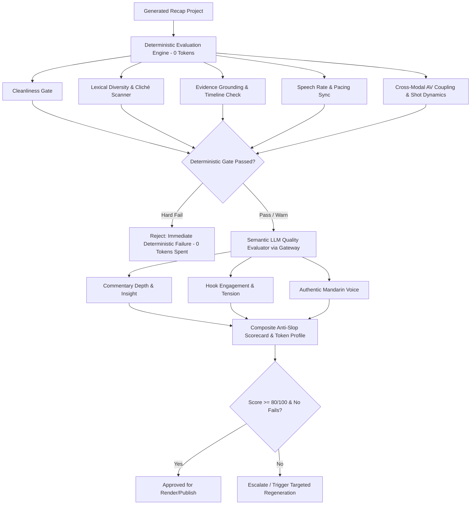

# Movie Commentary Evaluation & Anti-AI-Slop Quality Specification

**Version:** 1.1  
**Status:** Active  
**Last Updated:** 2026-09-13  
**Superseded By:** N/A  

---

## 1. Executive Summary & Purpose

The **Movie Commentary Autopilot** produces automated long-form Mandarin commentary videos from source films. While automated pipelines can easily assemble summaries, standard LLM-generated scripts often degenerate into **"AI Slop"**—formulaic, passive, repetitive recaps filled with robotic clichés, missing genuine analytical insight, and detached from visual pacing.

This specification establishes:
1. A **two-tier Evaluation Infrastructure** to detect, grade, and prevent AI Slop before video generation or publishing.
2. A dedicated **Cross-Modal Audio-Visual Coupling** metric ensuring visual scene cuts match narration content and pacing.
3. Strict **Evaluator Token Cost Profiling** measuring per-metric token spend and verifying that deterministic checks consume **0 tokens**.

---

## 2. Defining "AI Slop" in Movie Recaps

An automated movie recap is classified as **AI Slop** if it exhibits any of the following failure modes:

| AI Slop Category | Characteristics & Symptoms | Detection Method |
| :--- | :--- | :--- |
| **Formulaic Clichés & Templates** | Overuse of stereotypical transition phrases (*"不得不说"*, *"让我们拭目以待"*, *"事情并没有那么简单"*, *"镜头一转"*, *"总而言之"*). | Deterministic (Regex / Ban-list matcher) |
| **Passive Dry Summary** | Monotonous "Character A did X, then Character B did Y" without editorial interpretation, cultural context, directorial criticism, humor, or thematic analysis. | Semantic LLM Judge (Commentary Depth Rubric) |
| **Repetitive Vocabulary & N-grams** | Low lexical diversity, looping phrases, high token repetition within short windows. | Deterministic (Type-Token Ratio, Distinct-2/3 n-grams) |
| **Audio-Visual Disconnect** | Narration discusses character emotions/dialogue while video shows unrelated scenery, or shot lingers statically for >12s during intense commentary. | Cross-Modal AV Matcher & Shot Duration Analysis |
| **Evidence & Timeline Disconnect** | Commentary describes scenes that do not match the underlying video clip timestamps or reveals climax spoilers in the opening. | Deterministic (Timestamp mapping & chronological validation) |
| **Mechanical & Formatting Leaks** | Raw JSON keys, punctuation words synthesized by TTS (*"下划线"*, *"引号"*), code blocks, unparsed markdown. | Deterministic (Cleanliness scanner) |
| **Robotic Delivery & Pacing** | Monotone sentence length, abnormal speaking rates (<200 or >290 chars/min), excessive subtitle gaps or overlaps. | Deterministic (Speech timing & audio alignment) |

---

## 3. Evaluation Architecture & Pipeline

The evaluation pipeline follows a **Deterministic-First** hierarchy:

---

## 4. Evaluation Rubric & Scoring Model

The overall **Anti-Slop Quality Score (0–100)** is computed across 10 calibrated dimensions (weights sum to 1.00, with 60% executed deterministically at 0 tokens):

$$\text{Total Score} = \sum_{i=1}^{10} w_i \cdot S_i$$

| Metric Dimension ($S_i$) | Weight ($w_i$) | Evaluation Method | Target / Passing Threshold |
| :--- | :---: | :---: | :--- |
| **1. Movie Identity & Anti-Contamination** | **8%** | Deterministic (0 tokens) | Title isolation; foreign movie marker detection. |
| **2. Cleanliness & Formatting** | **5%** | Deterministic (0 tokens) | 100 points: 0 JSON keys, 0 code fences, 0 TTS punctuation leaks. Hard fail on leak. |
| **3. Lexical Diversity & Cliché Avoidance** | **8%** | Deterministic (0 tokens) | $\text{TTR} \ge 0.45$, $\text{Distinct-2} \ge 0.85$, 0 blacklist clichés. |
| **4. Evidence & Temporal Alignment** | **7%** | Deterministic (0 tokens) | $100\%$ body segments mapped to source timestamps. |
| **5. Storyteller Narrative Continuity** | **12%** | Deterministic (0 tokens) | Monotonicity $\ge 90\%$, Transition coherence on scene jumps $\ge 80\%$, Entity threading, 0 backward timeline regressions. |
| **6. Cross-Modal Audio-Visual Coupling** | **15%** | Deterministic + Index Matching (0 tokens) | Content-grounded scene matching $\ge 80\%$, drift $|\Delta t| \le 0.5\text{s}$, 0 duplicate loop cuts, phase adherence. |
| **7. Pacing & Speaking Rate** | **5%** | Deterministic (0 tokens) | $220\text{--}280\text{ Chinese chars/min}$. |
| **8. Commentary Depth & Insight** | **20%** | Semantic LLM Judge | Score $\ge 75/100$: Original analysis, character psychology, thematic deconstruction. |
| **9. Authentic Mandarin Voice** | **10%** | Semantic LLM Judge | Natural Chinese video essayist tone, avoidance of robotic/literal translations. |
| **10. Hook Engagement & Tension** | **10%** | Semantic LLM Judge | Score $\ge 75/100$: High-curiosity hook without spoilers, dramatic narrative pull. |

---

## 5. Evaluator Token Cost Profiling Contract

To enforce token minimization:
1. **Deterministic Evaluator Spend**: MUST be strictly **0 tokens** and **$0.00 USD**.
2. **Deterministic Early Exit**: If a hard deterministic failure is found (e.g. JSON leaks), semantic LLM evaluation is completely skipped, saving 100% of evaluation LLM tokens.
3. **Per-Evaluator Telemetry**: Every evaluation report records:
   - `evaluator_name`
   - `is_deterministic`
   - `input_tokens` / `output_tokens`
   - `cost_usd`
   - `cache_hit`
4. **Target Evaluation Budget**: Total evaluation LLM cost must not exceed **$0.01 USD** per movie recap.
