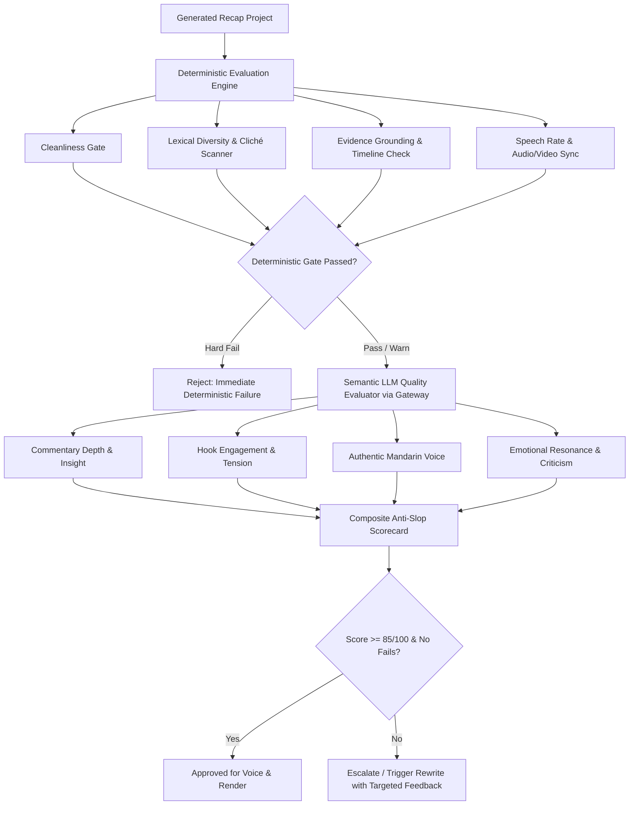

# Movie Commentary Evaluation & Anti-AI-Slop Quality Specification

**Version:** 1.0  
**Status:** Active  
**Last Updated:** 2026-09-13  
**Superseded By:** N/A  

---

## 1. Executive Summary & Purpose

The **Movie Commentary Autopilot** produces automated long-form Mandarin commentary videos from source films. While automated pipelines can easily assemble summaries, standard LLM-generated scripts often degenerate into **"AI Slop"**—formulaic, passive, repetitive recaps filled with robotic clichés, missing genuine analytical insight, and detached from visual pacing.

This specification establishes a **rigorous two-tier Evaluation Infrastructure** designed to detect, grade, and prevent AI Slop before video generation or publishing.

---

## 2. Defining "AI Slop" in Movie Recaps

An automated movie recap is classified as **AI Slop** if it exhibits any of the following failure modes:

| AI Slop Category | Characteristics & Symptoms | Detection Method |
| :--- | :--- | :--- |
| **Formulaic Clichés & Templates** | Overuse of stereotypical transition phrases (*"不得不说"*, *"让我们拭目以待"*, *"事情并没有那么简单"*, *"镜头一转"*, *"总而言之"*). | Deterministic (Regex / Ban-list matcher) |
| **Passive Dry Summary** | Monotonous "Character A did X, then Character B did Y" without editorial interpretation, cultural context, directorial criticism, humor, or thematic analysis. | Semantic LLM Judge (Commentary Depth Rubric) |
| **Repetitive Vocabulary & N-grams** | Low lexical diversity, looping phrases, high token repetition within short windows. | Deterministic (Type-Token Ratio, Distinct-2/3 n-grams) |
| **Evidence & Visual Disconnect** | Commentary describes scenes that do not match the underlying video clip timestamps or reveals climax spoilers in the opening. | Deterministic (Timestamp mapping & chronological validation) |
| **Mechanical & Formatting Leaks** | Raw JSON keys, punctuation words synthesized by TTS (*"下划线"*, *"引号"*), code blocks, unparsed markdown. | Deterministic (Cleanliness scanner) |
| **Robotic Delivery & Pacing** | Monotone sentence length, abnormal speaking rates (<200 or >290 chars/min), excessive subtitle gaps or overlaps. | Deterministic (Speech timing & audio alignment) |

---

## 3. Evaluation Architecture & Pipeline

The evaluation pipeline follows a **Deterministic-First** hierarchy:

---

## 4. Evaluation Rubric & Scoring Model

The overall **Anti-Slop Quality Score (0–100)** is computed across 5 weighted dimensions:

$$\text{Total Score} = 0.20 \cdot S_{\text{clean}} + 0.20 \cdot S_{\text{diversity}} + 0.25 \cdot S_{\text{commentary}} + 0.20 \cdot S_{\text{voice}} + 0.15 \cdot S_{\text{alignment}}$$

### Dimensions:
1. **$S_{\text{clean}}$ Cleanliness & Formatting (Weight: 20%)**:
   - 100 points: Zero JSON keys, brackets, underscores, or formatting leaks.
   - 0 points (Hard Fail): Any unparsed JSON or code tokens present.
2. **$S_{\text{diversity}}$ Lexical Diversity & Cliché Avoidance (Weight: 20%)**:
   - Evaluates Type-Token Ratio (TTR), Distinct-2/3 n-grams, and penalizes matched clichés from the blacklist.
3. **$S_{\text{commentary}}$ Commentary Depth vs Summary (Weight: 25%)**:
   - Semantic evaluation of whether the text provides genuine critical insight, metaphors, character psychology, and thematic deconstruction.
4. **$S_{\text{voice}}$ Natural Mandarin Narrative Voice (Weight: 20%)**:
   - Evaluates whether the script sounds like an authentic top-tier documentary/video essayist (e.g. Bilibili/YouTube cinema creator style) rather than translated AI output.
5. **$S_{\text{alignment}}$ Evidence & Audio-Visual Alignment (Weight: 15%)**:
   - Validates that 100% of body segments reference verified scene timestamps, chronologically ordered, with audio durations matching video cuts within tolerance.

---

## 5. Grading Tiers & Action Thresholds

| Grade | Score Range | Status | Action |
| :--- | :---: | :--- | :--- |
| **Tier S / A** | 90–100 | **Excellent** | Instant pass, publish ready. |
| **Tier B** | 80–89 | **Acceptable** | Pass with minor optimization suggestions. |
| **Tier C** | 70–79 | **Borderline Slop** | Warning; requires targeted rewriting of low-scoring segments. |
| **Tier F** | < 70 (or any Hard Fail) | **AI Slop / Rejected** | Block video render; regenerate script with feedback prompt. |

---

## 6. Benchmark Test Suite & Regression Testing

The test suite evaluates standard benchmark movies across diverse genres:
- `tears_of_steel`: Sci-Fi short (visual effects, cybernetics, romance, pacing).
- `sintel`: Fantasy short (character emotion, dialogue-free visual interpretation).
- `big_buck_bunny`: Animation comedy (humor, comedic timing, non-dialogue storytelling).

Each benchmark run records tokens consumed, evaluation scores, and regression status in the project evaluation log.
