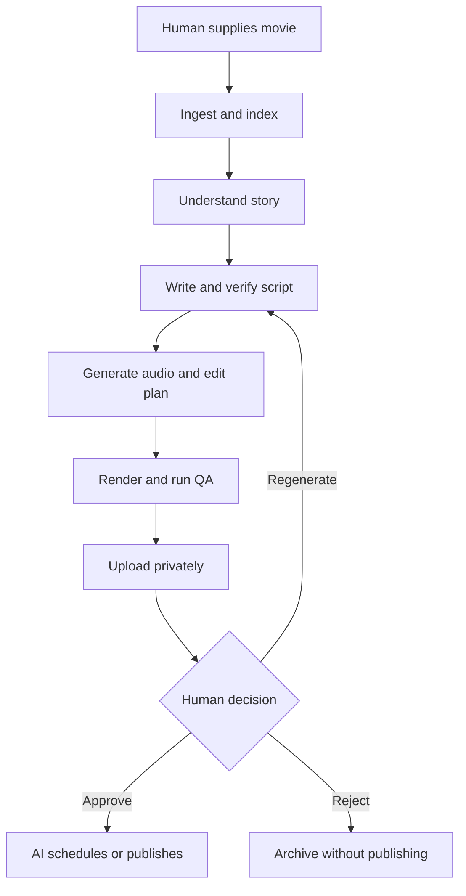
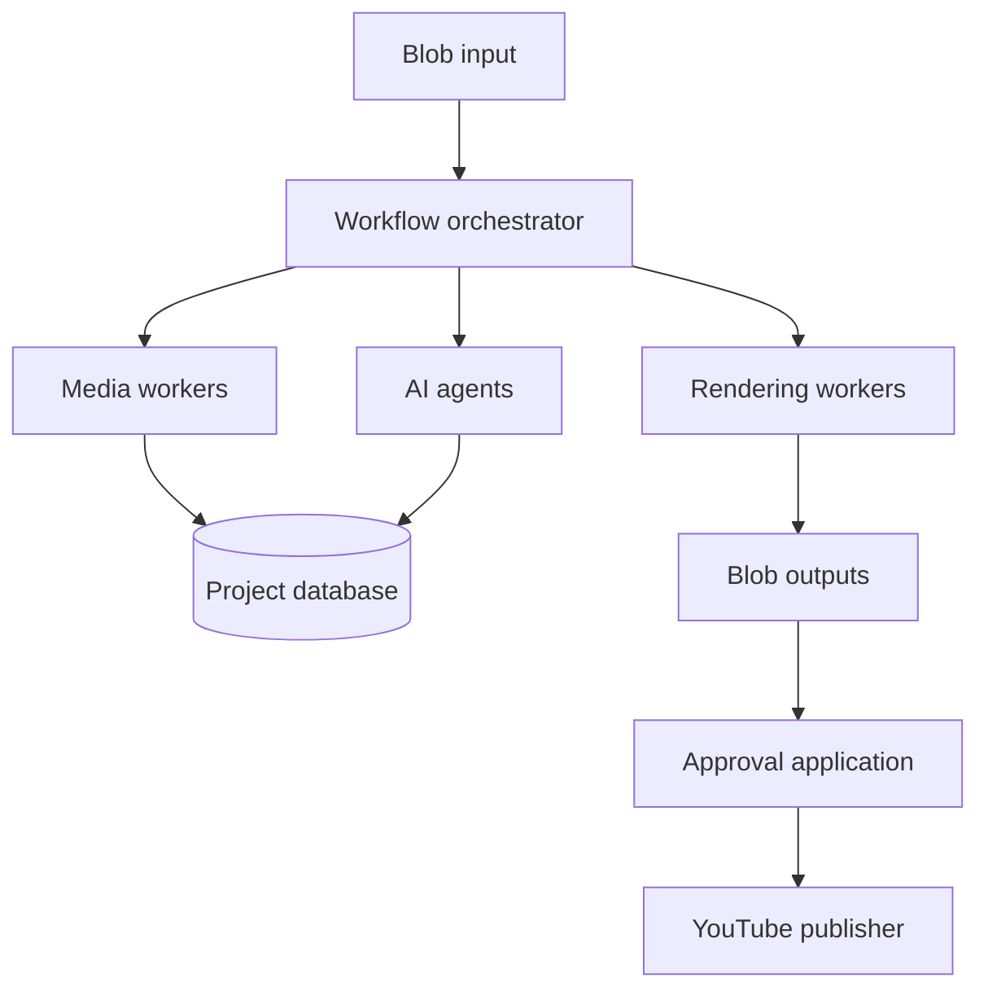

# Movie Commentary Autopilot

**Product Requirements Document (PRD)**  
**Version:** 0.2  
**Date:** September 13, 2026  
**Status:** Draft for MVP planning

## 1. Executive summary

Movie Commentary Autopilot is a human-supervised AI production system that turns a human-supplied movie file into a finished, privately uploaded YouTube commentary video. AI owns the complete production workflow: media ingestion, transcription, scene understanding, plot reconstruction, commentary-script generation, voice generation, clip selection, video editing, subtitles, thumbnail and metadata creation, quality assurance, private upload, and post-approval publishing.

The human retains three responsibilities:

1. Find and lawfully obtain the source movie.
2. Review the completed video and YouTube restriction status.
3. Approve, reject, or request regeneration.

After approval, the system schedules or publishes the video automatically.

The MVP targets 20–30-minute Mandarin-language movie-commentary videos. The architecture should support Cantonese and English variants later.

## 2. Problem statement

Long-form Chinese movie-recap and commentary channels demonstrate strong audience demand, but producing each video conventionally requires substantial repetitive work: watching and understanding the movie, writing a condensed narrative, recording voice-over, locating relevant scenes, editing, captioning, preparing metadata, uploading, and scheduling.

For a creator with a demanding full-time job, this production burden prevents consistent publishing. Existing AI tools automate isolated steps but generally do not provide a reliable, auditable, end-to-end workflow with factual grounding, narration-to-scene alignment, quality gates, and human approval.

The product should reduce routine human production time to approximately 5–15 minutes per video after the source file is supplied, while maintaining sufficient accuracy, originality, consistency, and production quality to build a sustainable channel.

## 3. Product principles

1. **AI produces; the human authorizes.** No video becomes public without explicit human approval.
2. **Evidence-grounded generation.** Every plot statement and selected clip must trace back to timestamps in the supplied source.
3. **Commentary, not mechanical transcription.** The result must contain a recognizable editorial perspective and meaningful original commentary.
4. **Fail closed.** Low-confidence, policy-sensitive, or technically defective outputs enter an exception queue instead of publishing.
5. **No rights circumvention.** The product will not discover pirated sources, bypass DRM, defeat Content ID, or automatically dispute copyright claims.
6. **Deterministic rendering.** AI proposes the editorial timeline; a deterministic renderer produces reproducible output.
7. **Full auditability.** Prompts, model versions, source timestamps, generated assets, quality results, approvals, and publication events are retained.
8. **Deterministic-first and token-efficient.** Shell commands, conventional code, media utilities, parsers, rules, and statistical models must perform work that does not require language understanding or judgment. LLMs are reserved for genuinely semantic, ambiguous, creative, or decision-oriented tasks.

### 3.1 Deterministic-first execution policy

The system is an agentic workflow, but it must not treat an LLM as its universal runtime. Each workflow step must first answer:

> Can this task be completed reliably by a shell command, script, library, API, database query, rule, or conventional model?

If yes, the deterministic implementation is required. An LLM may be used only when the task requires interpretation, synthesis, creative generation, semantic comparison, or judgment that deterministic methods cannot reliably provide.

Examples:

| Task | Required implementation |
| --- | --- |
| Inspect codecs, duration, streams, and frame rate | `ffprobe` or media-library code |
| Extract audio, frames, clips, and subtitles | `ffmpeg` or equivalent media tooling |
| Detect file changes and duplicate sources | Cryptographic hashes |
| Parse SRT/VTT and manipulate timestamps | Script or parsing library |
| Detect scene cuts | Purpose-built scene-detection algorithm or library |
| Validate JSON/schema, paths, durations, and state transitions | Typed code and schema validation |
| Calculate speaking rate, clip lengths, budgets, and loudness | Scripts, media filters, and arithmetic |
| Render the timeline | FFmpeg or Remotion from an explicit edit manifest |
| Upload, poll, schedule, retry, and notify | APIs, workflow code, and durable queues |
| Understand ambiguous plot events or character relationships | LLM/multimodal model |
| Write commentary and transitions | LLM with grounded context |
| Evaluate whether commentary is coherent and distinctive | Independent LLM evaluation plus deterministic similarity signals |
| Judge whether a clip semantically supports narration | Multimodal/embedding model, used only after deterministic candidate narrowing |

An LLM call must declare:

- Why deterministic processing is insufficient.
- The smallest context required for the decision.
- A structured output schema.
- A token and cost budget.
- A confidence or evaluation strategy.
- Whether the result can be cached by input hash.

The orchestrator must reject unregistered, open-ended LLM calls from production workflow steps.

## 4. Goals and non-goals

### 4.1 MVP goals

- Convert one human-supplied movie file into a coherent 20–30-minute commentary video.
- Produce a factually grounded Mandarin narration script with original commentary.
- Minimize LLM token consumption without materially reducing content quality.
- Generate consistent, natural-sounding narration.
- Automatically select source scenes that correspond to each narration segment.
- Render a complete 1080p video with subtitles, transitions, branding, and licensed music.
- Generate three title and thumbnail candidates.
- Perform automated factual, audiovisual, duplication, and content-sensitivity checks.
- Upload the package privately to YouTube.
- Provide a simple approval experience.
- Publish or schedule automatically after approval.
- Collect performance analytics to inform later productions.

### 4.2 Non-goals

- Automatically downloading commercial movies or bypassing streaming protections.
- Determining conclusively whether a use of copyrighted material is legally fair use.
- Guaranteeing monetization, lack of Content ID claims, or YouTube Partner Program acceptance.
- Automatically filing copyright disputes, appeals, or counter-notifications.
- Producing daily videos in the MVP.
- Supporting television seasons, multi-movie compilations, Shorts, or multiple channels in the MVP.
- Building a generalized consumer video editor.

## 5. Target user and use case

### 5.1 Primary user

A technically sophisticated solo creator who:

- Has a demanding full-time position and little production time.
- Can find and supply source media.
- Wants AI to own all audio and video production work.
- Is willing to perform a short final review before publication.
- Wants to validate movie commentary as a scalable side-income business.

### 5.2 Primary use case

1. The creator finds and lawfully obtains a movie.
2. The creator places the movie in the configured input location.
3. The system processes the movie without further input.
4. The creator receives a notification when a review package is ready.
5. The creator reviews the video, title/thumbnail choices, QA report, and YouTube Restrictions result.
6. The creator selects **Approve**, **Regenerate**, or **Reject**.
7. Following approval, the system schedules or publishes the video.

## 6. End-to-end workflow



### 6.1 Workflow states

`RECEIVED → INGESTING → ANALYZING → SCRIPTING → GENERATING_AUDIO → PLANNING_EDIT → RENDERING → AUTOMATED_QA → YOUTUBE_PRIVATE → AWAITING_APPROVAL → APPROVED → SCHEDULED → PUBLISHED`

Any processing state may transition to `RETRYING`, `NEEDS_REVIEW`, or `FAILED`. A rejected project transitions to `ARCHIVED`.

## 7. Functional requirements

### FR-1: Source ingestion

The system shall:

- Monitor a configured upload folder or object-storage location.
- Accept common media containers supported by FFmpeg.
- Validate that the file is readable and contains usable video and audio tracks.
- Extract technical metadata including duration, resolution, frame rate, codecs, audio tracks, and embedded subtitles.
- Accept optional user metadata: movie title, release year, source language, target language, desired duration, and editorial style.
- Default missing target settings from the channel profile.
- Generate a stable project identifier and immutable source fingerprint.

MVP input example:

```text
incoming/
  movie-title/
    source.mp4
    subtitles.srt       # optional
    metadata.json       # optional
```

### FR-2: Transcription and media indexing

The system shall:

- Transcribe dialogue with word- or phrase-level timestamps.
- Prefer supplied or embedded subtitles when their quality is higher than automatic transcription.
- Detect scene boundaries and shots.
- Sample keyframes from every scene.
- OCR important on-screen text.
- Identify recurring speakers and principal characters when reasonably possible.
- Store a searchable scene index containing timestamps, transcript text, visual descriptions, characters, locations, actions, emotional tone, and content-sensitivity labels.

Media inspection, audio extraction, subtitle parsing, timestamp manipulation, scene-cut detection, frame sampling, OCR preprocessing, hashing, and index persistence must use scripts or purpose-built tools. LLM or multimodal calls may describe selected scenes and resolve semantic ambiguity only after deterministic preprocessing has reduced the input to the minimum useful evidence.

### FR-3: Story understanding

The system shall create:

- Character and alias registry.
- Chronological event timeline.
- Character-relationship graph.
- Location registry.
- Major conflict, turning-point, climax, and resolution summary.
- Ambiguity list for events or identities the system cannot establish confidently.

Each extracted event must reference supporting transcript passages and source timestamps.

The system must not repeatedly send the full transcript or large frame collections to an LLM. It shall use hierarchical processing:

1. Deterministically segment transcript and scene data.
2. Create bounded semantic summaries for local sequences.
3. Persist reusable structured facts and embeddings.
4. Send only relevant summaries, evidence spans, and selected keyframes to later reasoning steps.
5. Retrieve original transcript or frames only when a verifier needs stronger evidence.

### FR-4: Script generation

The system shall generate a target-language script containing:

- A 30–60-second opening hook.
- A clear, condensed story progression.
- Original transitions and recurring editorial voice.
- Interpretation, reaction, cultural context, criticism, humor, or analysis distributed throughout the video.
- A concluding assessment or interpretation.
- Optional spoiler and viewing recommendation language.

The initial Mandarin target is approximately 6,000–8,000 Chinese characters for a 20–30-minute video, adjusted using the selected narrator’s measured speaking rate.

Every narration segment must include:

```json
{
  "segment_id": "narration-014",
  "text": "直到这里，他才意识到搭档一直隐瞒着关键证据。",
  "supporting_scenes": [
    {"start_seconds": 4422.1, "end_seconds": 4449.0}
  ],
  "confidence": 0.94,
  "segment_type": "plot_and_commentary"
}
```

### FR-5: Script verification and originality

Before audio generation, separate evaluator passes shall check:

- Character names and identities.
- Event ordering and causal relationships.
- Ending accuracy.
- Unsupported claims and hallucinations.
- Contradictions within the script.
- Appropriate commentary density.
- Similarity to previously published scripts.
- Repetitive phrases, hooks, transitions, or conclusions.
- Naturalness and pronunciation suitability.

Low-confidence segments must be rewritten, removed, or escalated. The writer model must not self-approve its own output without an independent evaluation pass.

Deterministic checks must run before LLM evaluation, including schema validity, missing evidence, event-order constraints, name consistency against the character registry, phrase-frequency analysis, exact/near-duplicate detection, length, and speaking-time calculations. The LLM evaluator receives only findings and evidence that require semantic judgment.

### FR-6: Voice generation

The system shall:

- Use a consistent approved synthetic voice or a clone of the creator’s own voice.
- Generate narration at segment level to support localized regeneration.
- Maintain a pronunciation dictionary for names, foreign titles, and recurring phrases.
- Normalize loudness and remove audible discontinuities.
- Record voice provider, model, settings, and asset hashes for reproducibility.
- Set YouTube synthetic-media metadata when applicable.

### FR-7: Automated clip selection

The clip planner shall:

- Select scenes that directly support or complement each narration segment.
- Produce a structured edit-decision list with source timestamps.
- Avoid accidentally revealing later plot events before the narration reaches them.
- Avoid excessive reuse of the same scene.
- Prefer visual variety while preserving narrative continuity.
- Exclude or flag explicit sexual material, graphic violence, and other advertiser-sensitive scenes according to the channel policy.
- Use generated or licensed supplementary visuals where a suitable source scene is unavailable.
- Treat cropping, reframing, overlays, or clip shortening as editorial choices, not as rights protection.

There shall be no feature intended to bypass or defeat copyright-detection systems.

Candidate retrieval must be token-efficient. The system shall first narrow scenes using timestamps, character labels, transcript search, embeddings, sensitivity labels, and edit constraints. A multimodal model may rank or judge the reduced candidate set; it must not repeatedly inspect the entire movie for every narration segment.

### FR-8: Video assembly

The renderer shall produce:

- 1920×1080 output for the MVP.
- Narration synchronized with selected scenes.
- Burned-in or separately uploaded Chinese subtitles.
- Configurable logo, typography, colors, intro, and outro.
- Licensed background music with automatic ducking.
- Chapter markers.
- Consistent safe margins and mobile-readable captions.
- A deterministic final render and render manifest.

### FR-9: Thumbnail and metadata generation

The system shall create:

- Three thumbnail candidates.
- Three title candidates.
- A description containing the movie name, editorial summary, channel language, and appropriate disclosures.
- Tags, category, language, playlist selection, and chapters.
- A recommended publish time derived from channel history when sufficient data exists.

Titles and thumbnails must not assert facts unsupported by the movie or deliberately misidentify the content.

### FR-10: Automated quality assurance

The system shall verify:

- Video and audio streams are present and decodable.
- There are no unintended black, frozen, corrupted, or silent sections.
- Audio loudness remains within the configured range.
- Subtitles match the narration and stay within safe margins.
- Selected clips semantically correspond to the narration.
- No clip or source segment is accidentally repeated beyond configured limits.
- Sensitive-content policy is satisfied.
- Movie title, year, character, and actor references are consistent.
- Final duration is within the configured range.
- No temporary watermarks, debug overlays, filenames, prompts, or internal identifiers appear.

QA shall produce a human-readable report with pass, warning, and fail findings. A failed critical check blocks upload.

All mechanically testable QA requirements—including stream validity, duration, black frames, frozen frames, silence, loudness, subtitle boundaries, repeated source ranges, safe margins, missing files, hashes, and manifest consistency—must run through scripts or media-analysis utilities. LLM-based QA is limited to factual, semantic, narrative, tonal, and editorial review.

### FR-10A: LLM usage governance

The system shall maintain a central LLM gateway rather than allowing individual workers to call model providers directly. The gateway shall:

- Enforce an allowlist of approved semantic tasks.
- Require typed request and response schemas.
- Apply per-task model selection; inexpensive models handle bounded classification and stronger models handle complex story or editorial reasoning.
- Enforce input-token, output-token, cost, timeout, and retry limits.
- Cache responses using normalized input, prompt version, model version, and configuration hashes.
- Deduplicate concurrent identical requests.
- Track cache hits, tokens, latency, errors, and estimated cost by project and task.
- Prevent full transcripts, raw frame sequences, or redundant context from being sent when indexed evidence is sufficient.
- Use batch requests where they reduce overhead without weakening isolation or retry behavior.
- Permit escalation to a stronger model only after a recorded failure, low-confidence result, or evaluator rejection.

Agents should exchange compact structured artifacts—such as scene IDs, timestamps, facts, confidence scores, and edit decisions—rather than repeatedly exchanging prose descriptions of the entire movie.

### FR-11: Private YouTube upload

After QA passes, the system shall:

- Upload the video with private visibility.
- Upload the selected thumbnail and subtitles.
- Set metadata, playlist, audience classification, language, and applicable synthetic-media disclosure.
- Poll standard processing status until the video is playable.
- Present a direct link for the creator to inspect YouTube Studio’s Restrictions/copyright result.

The standard YouTube Data API does not provide every creator-facing Content ID decision available in YouTube Studio. Human approval must therefore include inspection of the current Restrictions result. New unverified API projects are restricted to private uploads until the project completes Google’s compliance audit.

### FR-12: Human approval

The review interface shall display:

- Embedded private video.
- Script and source-timestamp evidence.
- QA summary and warnings.
- Three title/thumbnail combinations.
- Proposed description and publication time.
- YouTube processing and Restrictions instructions/status where available.

The creator can:

- **Approve:** authorize the selected package for scheduling/publication.
- **Regenerate:** request regeneration of the script, voice, edit, thumbnail, metadata, or entire package with optional feedback.
- **Reject:** archive the project without publishing.

Approval must be explicit, authenticated, timestamped, and bound to the exact rendered video hash. Any subsequent change to the video invalidates the approval.

### FR-13: Publication

After approval, the system shall:

- Apply the chosen title, thumbnail, description, and schedule.
- Change privacy status or schedule publication through the YouTube API.
- Confirm the resulting public or scheduled state.
- Notify the creator of success or failure.
- Never file copyright claims, disputes, appeals, or counter-notifications automatically.

### FR-14: Analytics feedback

For published videos, the system should ingest available performance data, including:

- Impressions and click-through rate.
- Views and watch time.
- Average view duration and percentage viewed.
- Audience-retention drop-offs.
- Subscribers gained.
- Traffic sources and geography where available.
- Revenue metrics where authorized and available.
- Copyright or monetization restrictions.

Performance data may recommend future changes but must not silently rewrite channel policy or publish without approval.

## 8. Non-functional requirements

### Reliability

- Every stage must be idempotent or safely retryable.
- Large uploads and downloads must be resumable.
- The workflow must resume after process, container, or orchestrator restarts.
- Partial renders and intermediate assets must not be mistaken for completed output.

### Performance

- MVP target: complete a two-hour source movie within six hours of ingestion, excluding provider outages and YouTube processing time.
- Parallelize transcription, scene description, sensitivity analysis, and selected verification tasks.
- Analyze sampled frames rather than every frame unless a local region requires deeper inspection.

### Cost controls

- Set per-project budgets for model tokens, vision frames, TTS characters, compute time, and retries.
- Reuse cached transcripts, scene descriptions, and generated audio.
- Regenerate only affected segments when practical.
- Alert and pause before exceeding the configured project budget.
- Record separate budgets for input tokens, output tokens, multimodal inputs, transcription, speech, and compute.
- Use the least expensive capable model for each registered semantic task.
- Prefer deterministic validation and targeted regeneration over repeated full-context critique.
- Require justification in telemetry when a task escalates to a larger model or reloads full-resolution source evidence.

### Token-efficiency requirements

- No LLM call for filesystem operations, media conversion, timestamp arithmetic, schema validation, orchestration, retries, API polling, rendering, or other deterministic operations.
- No whole-movie frame upload to a multimodal model when sampled or retrieved frames are sufficient.
- No repeated whole-transcript submission after the transcript has been segmented and indexed.
- Prompts shall reference stable IDs and retrieve only task-relevant evidence.
- Intermediate semantic results shall be persisted and reused across scripting, clip planning, QA, regeneration, and analytics.
- Every project shall expose total and per-stage token consumption, cache-hit rate, and cost.
- Regression tests shall detect unexpected token growth for a fixed reference movie and workflow version.

### Security and privacy

- Encrypt source and generated media in transit and at rest.
- Use least-privilege identities and secret storage.
- Keep YouTube OAuth refresh tokens out of source control and logs.
- Restrict approval and publication permissions to the creator.
- Define configurable retention and deletion policies for source media.

### Observability

- Correlated logs and traces across all stages.
- Per-stage timing, cost, retry count, and model usage.
- Project-level audit trail.
- Alerts for failed renders, exceeded budgets, rejected uploads, and publication failures.

## 9. Reference architecture

The preferred implementation is a queue-based batch architecture.



The architecture contains two explicit execution planes:

- **Deterministic execution plane:** shell commands, Python/TypeScript workers, FFmpeg, parsers, schema validators, databases, APIs, queues, hashing, metrics, and rendering.
- **Semantic execution plane:** model gateway and narrowly scoped LLM/multimodal tasks for story interpretation, commentary writing, ambiguity resolution, and qualitative review.

The workflow orchestrator owns routing between the planes. Model-generated output never directly executes arbitrary shell commands or mutates publication state. It produces schema-validated proposals that deterministic workers execute under explicit policies.

### Suggested Azure-oriented stack

| Concern | Default choice |
| --- | --- |
| Source and output storage | Azure Blob Storage |
| Workflow orchestration | Durable Functions or an equivalent durable workflow engine |
| Batch execution | Azure Container Apps Jobs |
| Media processing | FFmpeg and FFprobe |
| Templated graphics | Remotion or deterministic FFmpeg filters |
| AI understanding and writing | Multimodal and text models behind a provider abstraction |
| Speech | High-quality TTS behind a provider abstraction |
| Metadata and workflow state | PostgreSQL or Cosmos DB |
| Searchable scene index | PostgreSQL vector extension or managed vector search |
| Approval UI | Small authenticated React web application |
| Publication | YouTube Data API with OAuth 2.0 |
| Secrets | Azure Key Vault |
| Monitoring | Application Insights and structured cost telemetry |
| Deterministic worker interface | Versioned command/script contracts with JSON input and output |
| LLM access | Central budgeted model gateway with caching and schema enforcement |

Model, speech, and hosting providers must be replaceable without redesigning the project data model.

## 10. Core data entities

- **ChannelProfile:** language, voice, tone, typography, content policy, target duration, disclosure defaults, and publishing schedule.
- **Project:** source identity, current state, configuration, cost, timestamps, and error information.
- **Scene:** boundaries, transcript, keyframes, visual description, characters, sensitivity labels, and embeddings.
- **StoryEvent:** description, chronology, characters, causal links, evidence, and confidence.
- **ScriptSegment:** narration, type, supporting scenes, confidence, pronunciation, and revision history.
- **VoiceAsset:** audio location, duration, voice settings, and source script version.
- **EditDecision:** narration asset, source clips, overlays, transitions, and timing.
- **Render:** immutable manifest, output hash, renderer version, and QA result.
- **Review:** selected assets, reviewer decision, feedback, approval hash, and timestamp.
- **Publication:** YouTube video ID, metadata, status, scheduled time, and subsequent restrictions.
- **AnalyticsSnapshot:** dated performance and revenue measurements.
- **DeterministicTaskRun:** command or worker version, validated inputs, outputs, hashes, duration, exit status, and retry history.
- **ModelInvocation:** registered task, reason for model use, prompt/model versions, evidence references, token counts, cost, cache status, confidence, and result hash.

## 11. Quality and policy thresholds

Initial thresholds should be configurable and refined through the pilot.

| Gate | MVP behavior |
| --- | --- |
| Unsupported plot claim | Rewrite or remove before rendering |
| Uncertain character identity | Escalate or avoid naming the character |
| Critical QA defect | Block upload |
| Sensitive visual above channel limit | Replace, omit, or require review |
| Excessive script similarity | Rewrite affected sections |
| YouTube copyright/restriction concern | Hold for explicit human review |
| Video changed after approval | Invalidate approval |
| Publication API failure | Keep private and notify; never repeatedly force public state |

## 12. Success metrics

### Product metrics

- Median human production time after source delivery: **≤15 minutes per video**.
- Successful end-to-end completion without engineering intervention: **≥80% by the tenth pilot video**.
- Critical factual errors discovered during human review: **≤1 per video by the tenth pilot video**.
- Narration segments paired with clearly relevant visuals: **≥95%**.
- Projects requiring full regeneration: **≤20%** after workflow stabilization.
- Unplanned public uploads: **zero**.
- Deterministic operations executed without an LLM: **100%**.
- LLM invocations missing a registered semantic purpose, structured schema, or budget: **zero**.
- Token and model-cost telemetry coverage: **100% of LLM/multimodal calls**.
- Repeated full-transcript submissions after indexing: **zero under normal execution**.
- Token consumption for the fixed regression movie must not increase by more than the configured tolerance between releases without an approved quality or capability justification.

### Channel-validation metrics

These are experimental targets rather than guarantees:

- Publish ten pilot videos on a consistent cadence.
- Observe organic impressions outside direct sharing.
- Achieve a sustainable average percentage viewed for the chosen duration.
- Generate repeat viewers and meaningful cross-video viewing.
- Record claims, restrictions, monetization outcome, revenue, and production cost per video.
- Continue investment only if audience traction and expected revenue justify compute cost and creator review time.

## 13. MVP scope and milestones

### Milestone 1: One-movie technical spike

- Ingest one movie.
- Generate transcript, scene boundaries, and keyframes.
- Produce grounded story events and a first script.
- Verify whether the narration-to-scene mapping is sufficiently accurate.
- Establish deterministic worker contracts, the central LLM gateway, caching, and a per-stage token/cost ledger.

**Exit criterion:** A reviewer can trace nearly every script segment to appropriate source evidence, and every model call has a registered semantic purpose, bounded context, structured output, and measured token cost.

### Milestone 2: End-to-end local production

- Add voice generation, clip planning, subtitles, branding, music, and deterministic rendering.
- Add automated audiovisual QA.
- Produce one complete 20–30-minute video.

**Exit criterion:** The video is watchable without manual editing and only requires localized regeneration or approval.

### Milestone 3: Approval and private upload

- Add the review application.
- Generate title/thumbnail candidates.
- Upload privately through the YouTube API.
- Bind approval to the immutable render.

**Exit criterion:** Human can approve or reject the exact private-uploaded package.

### Milestone 4: Automated publication and pilot

- Add scheduling/publication and notifications.
- Add analytics ingestion and cost reporting.
- Produce and publish ten pilot videos.

**Exit criterion:** A business decision can be made using audience, monetization, copyright, cost, and human-time data.

## 14. Key risks and mitigations

| Risk | Impact | Mitigation |
| --- | --- | --- |
| Copyright claim or block | Lost revenue or unavailable video | Private upload, human Restrictions review, source audit trail, no automated disputes |
| Reused or inauthentic-content determination | Channel demonetization | Meaningful commentary, distinct editorial voice, variation checks, human approval |
| Hallucinated plot or identity | Viewer distrust | Timestamp grounding, independent verification, confidence thresholds |
| Wrong visual paired with narration | Poor retention and credibility | Evidence-linked edit decisions and semantic clip QA |
| Generic synthetic voice | Weak channel identity | Consistent high-quality voice, pronunciation dictionary, optional creator voice clone |
| Explicit or violent scenes | Limited ads or age restrictions | Automated sensitivity labeling and channel-specific filtering |
| Costs exceed revenue | Negative unit economics | Per-project budgets, caching, segment regeneration, ten-video validation gate |
| API project remains private-only | Publication automation blocked | Apply for YouTube API compliance audit; retain human Studio publication fallback during MVP |
| Provider/model changes | Pipeline breakage or quality drift | Provider abstraction, model-version tracking, regression test project |
| Using LLMs for deterministic work | Excessive token cost, latency, variability, and difficult debugging | Deterministic-first policy, registered model tasks, central gateway, schema enforcement, token regression tests |
| Repeatedly sending full movie context | Runaway multimodal/token expense | Hierarchical indexing, retrieval, caching, candidate narrowing, evidence IDs |

## 15. Open product decisions

The following choices should be finalized before implementation:

1. Initial language: Mandarin, Cantonese, or both. **Proposed MVP: Mandarin.**
2. Initial niche: all movies or one category. **Proposed MVP: Korean thriller and drama films.**
3. Target duration. **Proposed MVP: 20–30 minutes.**
4. Narrator identity: licensed synthetic voice or creator voice clone.
5. Commentary style: serious analysis, humorous recap, provocative reaction, or hybrid.
6. Maximum compute and provider cost per video.
7. Source-media retention period after publication.
8. Whether approval happens in a dedicated web app or through a mobile-friendly notification link.
9. Whether the MVP renders only one final cut or two alternative edits.
10. Maximum LLM input/output token budget per movie and per semantic task.
11. Escalation rules for using a stronger model after low-confidence results.

## 16. Recommended MVP decisions

To minimize development time while testing the business hypothesis:

- Mandarin narration with one consistent voice.
- Korean thriller/drama movies as the initial niche.
- One 20–30-minute 1080p output per source.
- Three thumbnail/title candidates.
- Private YouTube upload followed by one explicit approval.
- Human inspection of YouTube Studio Restrictions before approval.
- No automated discovery, downloading, rights disputes, Shorts, dubbing, or multi-channel support.
- Ten-video pilot before scaling infrastructure or hiring production support.
- Deterministic scripts and media tools for all mechanical work, with LLM use restricted to registered semantic tasks.
- Per-project token, cache, and model-cost dashboard from the first technical spike.

## 17. External constraints and references

- YouTube requires monetized content to be original and authentic; generic, repetitive, mass-produced AI content can be ineligible. Reused material requires meaningful original commentary or modification, while copyright rules remain independently applicable: [YouTube channel monetization policies](https://support.google.com/youtube/answer/1311392?hl=en).
- Fair use is a fact-specific legal determination; credit, disclaimers, or adding some original material do not automatically establish fair use: [YouTube fair-use guidance](https://support.google.com/youtube/answer/9783148?hl=en).
- Content ID claims can block, track, or redirect monetization, and YouTube does not mediate fair-use disputes: [YouTube copyright claims](https://support.google.com/youtube/answer/6013276?hl=en).
- YouTube requires disclosure for certain realistic synthetic or meaningfully altered media, while AI production assistance and cloning one’s own voice are listed as examples that ordinarily do not require disclosure: [YouTube AI disclosure guidance](https://support.google.com/youtube/answer/14328491?hl=en).
- The YouTube Data API supports private upload, metadata, scheduling, privacy state, and synthetic-media status. Unverified API projects created after July 28, 2020 are restricted to private uploads until audited: [YouTube `videos.insert` reference](https://developers.google.com/youtube/v3/docs/videos/insert).

---

### Product decision

Proceed only as a measured ten-video experiment. The system’s primary promise is not guaranteed passive income; it is reducing production labor sufficiently to test whether a distinctive, AI-assisted movie-commentary channel can achieve acceptable audience growth and unit economics without compromising human approval or channel safety.
