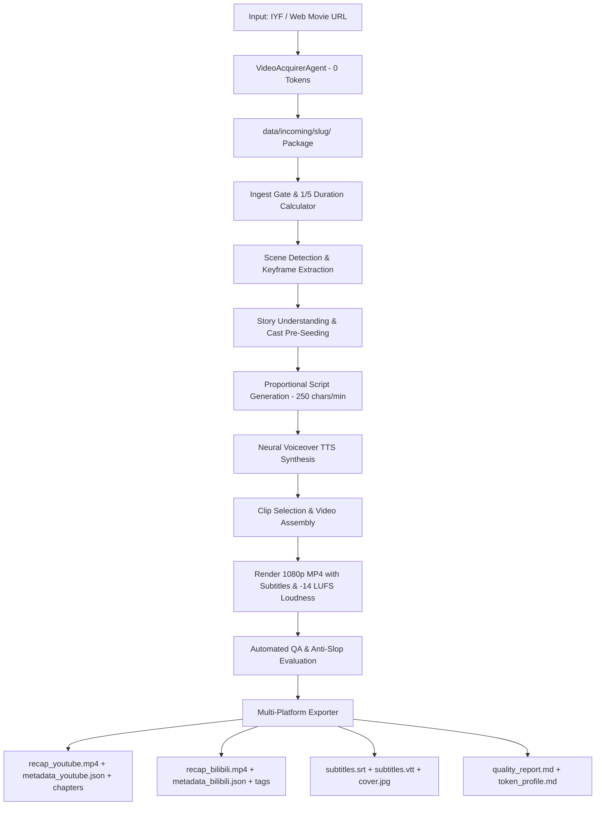

# End-to-End Autonomous Movie Recap Specification & Platform Export Standard

**Version:** 1.0  
**Status:** Active  
**Last Updated:** 2026-09-13  
**Superseded By:** N/A  

---

## 1. Executive Summary & Purpose

The **Movie Recap Autopilot End-to-End Pipeline** automates the entire lifecycle:
1. **Input**: An online video URL (e.g., 爱壹帆 / IYF / yfsp.tv or generic stream link), with optional user-specified target length.
2. **Proportional Duration Engine**: Automatically computes and constrains the output recap duration to **1/5 of the source movie's original duration** (20% ratio), unless explicitly overridden by the user.
3. **Multi-Platform Output Packaging**: Produces ready-to-upload packages tailored for **YouTube**, **Bilibili**, and other global streaming platforms (normalized -14 LUFS audio, 1080p faststart MP4, chapter markers, thumbnail covers, localized metadata schemas, and SRT/VTT subtitles).

---

## 2. End-to-End Pipeline Architecture



---

## 3. 1/5 Proportional Duration Calculation Rules

Unless explicitly specified by the user:
- **Default Duration Ratio**: `0.20` (1/5 of original runtime).
- **Target Recap Duration**: $\text{Target Minutes} = \text{Source Duration Minutes} \times 0.20$.
- **Script Target Character Budget**: $\text{Target Characters} = \text{Target Minutes} \times 250\text{ chars/min}$.
- **Dynamic Segment Scaling**:
  - For Short Videos ($\le 3$ min recap): Hook (100-150 chars) + 2-3 body segments (150-200 chars) + Conclusion (100-150 chars).
  - For Feature Films (15-25 min recap): Hook (200-250 chars) + 10-15 body segments (250-400 chars) + Conclusion (300-400 chars).

---

## 4. Multi-Platform Export Specifications

### 4.1 YouTube Export Bundle
- **Video Format**: MP4 container, H.264 video codec, AAC audio (192 kbps, 48kHz stereo), `-movflags +faststart`.
- **Audio Normalization**: YouTube standard -14 LUFS integrated loudness, -1.5 dBTP true peak (EBU R128).
- **Subtitles**: Separate closed-caption files (`.srt` and `.vtt`) + optional burned subtitles.
- **`metadata_youtube.json`**:
  ```json
  {
    "title": "【电影解说】《微风襟袖同卿心》李度杨策夫妻共历风雨蜕变成长",
    "description": "《微风襟袖同卿心》完整剧情解说与深度点评...\n\n⏰ 章节导航 (Chapters):\n00:00 精彩开场\n00:32 故事起源\n01:15 矛盾升级\n01:48 结局评析\n\n主演: 范梦, 张植绿\n导演: 张亚海\n\n#电影解说 #微风襟袖同卿心 #影视解说",
    "tags": ["微风襟袖同卿心", "电影解说", "影视推荐", "短剧", "范梦", "张植绿"],
    "categoryId": "1",
    "privacyStatus": "private"
  }
  ```

### 4.2 Bilibili Export Bundle
- **Video Format**: 1080p MP4, H.264/AAC, compliant stream structure.
- **`metadata_bilibili.json`**:
  ```json
  {
    "title": "【几分钟看懂】《微风襟袖同卿心》夫妻双向成全与成长历程",
    "tid": 182,
    "type": 1,
    "desc": "本期带来《微风襟袖同卿心》精彩解说。讲述李度与杨策相守相伴的动人故事...",
    "tag": "影视解说,电影推荐,微风襟袖同卿心,古装,短剧,范梦",
    "dynamic": "#电影解说# 今日推荐《微风襟袖同卿心》速看！"
  }
  ```

---

## 5. Unified CLI Interface

```bash
# Standard 1/5 duration auto-recap
python scripts/produce_recap.py "https://www.yfsp.tv/play/zqBWB3mQYiB?id=2XQtVuG1mT3"

# Custom target duration (e.g. 3 minutes)
python scripts/produce_recap.py "https://www.yfsp.tv/play/zqBWB3mQYiB?id=2XQtVuG1mT3" --target-duration 3.0

# Custom duration ratio (e.g. 0.15 = 15%)
python scripts/produce_recap.py "https://www.yfsp.tv/play/zqBWB3mQYiB?id=2XQtVuG1mT3" --duration-ratio 0.15
```
